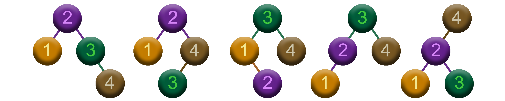

${\huge\color{Cadetblue}\text{\Huge Optimal Binary}}$  
${\huge\color{Cadetblue}\text{\Huge Search Trees (OBST)}}$

 

${\Large\color{rosybrown}\text{Problem}}$

Given a sorted sequence of $n$ distinct keys $K = \langle k_0, k_1, \ldots, k_{n-1} \rangle$ in increasing order, and a sequence of $n$ probabilities $P = \langle p_0, p_1, \ldots, p_{n-1} \rangle$ that sum to 1, the task is to build an optimal binary search tree (OBST) for $K$.  

 

   

   

   

 

${\Large\color{darkseagreen}\text{The key idea}}$

   

 

${\Large\color{darkseagreen}\text{Brute force}}$

 

${\Large\color{darkseagreen}\text{Top-down}}$

 

${\Large\color{darkseagreen}\text{Bottom-up}}$
