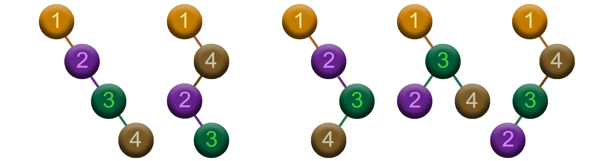

${\huge\color{Cadetblue}\text{\Huge Optimal Binary}}$  
${\huge\color{Cadetblue}\text{\Huge Search Trees (OBST)}}$

 

${\Large\color{rosybrown}\text{Problem}}$

Given a sorted sequence of $n$ distinct keys $K = \langle k_0, k_1, \ldots, k_{n-1} \rangle$ in increasing order, and a sequence of $n$ search probabilities $P = \langle p_0, p_1, \ldots, p_{n-1} \rangle$ that sum to 1, the task is to build an optimal binary search tree (OBST) for $K$. The probability $p_i$ represents the probability that a search will be for key $k_i$, and an OBST is a binary search tree for which the average search time is minimized, that is, the expected search cost is minimized.

Now, the expected search cost of a binary search tree is the sum of the costs of each key, where the cost of a key $k_i$ is the depth of $k_i$ in the tree plus 1, weighted by the probability of searching for $k_i$. As is customary, the depth of a key in a binary search tree is given by the length of the unique simple path from the root to the node containing the key. This means that the depth of the root is 0, and the depth of any other node is 1 plus the depth of its parent. As a result, the expected search cost for a BST $T$ is given by the following formula:

$$E[T] = \sum_{i=0}^{n-1} p_i \cdot (d_i + 1)$$

where $d_i$ is the depth of the key $k_i$ in the BST.

 

${\Large\color{rosybrown}\text{Example}}$

Consider the example where we have the following keys and corresponding search probabilities:

$$K = \langle 1, 2, 3, 4 \rangle\\
P = \langle 0.3, 0.1, 0.2, 0.4 \rangle$$

The task is to build an OBST for the keys in $K$.  

The number of possible binary search trees for $n$ keys is $C_n$, where $C_n$ is the $n^{th}$ ${\color{peru}\text{Catalan number}}$. It can be computed using the following formula:

$$C_n = \frac{1}{n+1} \binom{2n}{n}$$

So, for $n = 3$, we have $C_3 = 5$ possible binary search trees. In our example, we have $n = 4$ keys, so we have $C_4 = 14$ possible binary search trees, as shown in the figures below.

 

   

   

   

 

Each of these $14$ trees comes with its own expected search cost. From left to right, and top to bottom, the expected search costs, using the formula above, are: $2.7$, $2.2$, $2.5$, $2.2$, $2.1$, $2.3$, $2.1$, $1.9$, $2.1$, $2.1$, $2.1$, $2.0$, $2.1$, and $2.3$. So, out of the $14$ possible binary search trees, the ${\color{peru}\text{optimal}}$ binary search tree is the one with the minimum expected search cost, which is $1.9$.

 

${\Large\color{darkseagreen}\text{The key idea}}$

The question is how to build an OBST from a sorted sequence of keys and their corresponding search probabilities. At first glance, it seems that we could build such a tree by using a [greedy strategy](https://github.com/pl3onasm/CLRS/tree/main/algorithms/greedy), where we always choose the key with the maximum search probability as the root of the (sub)tree, and then recursively build the left and right subtrees.

While this strategy may work in some cases, it does not guarantee that the resulting tree will be optimal. This is also illustrated by the example above: the BST generated by the greedy strategy, shown on the left in the figure below, has an expected search cost of $2.0$, which is not the optimal expected search cost of the OBST shown on the right, which is $1.9$.

   

 

${\Large\color{darkseagreen}\text{Brute force}}$

 

${\Large\color{darkseagreen}\text{Top-down}}$

 

${\Large\color{darkseagreen}\text{Bottom-up}}$
